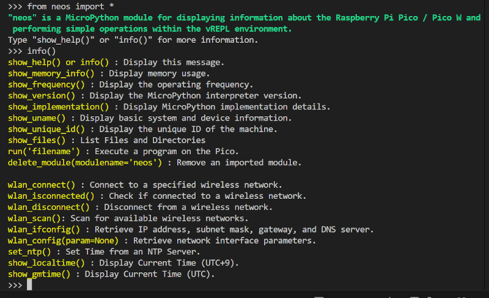

# neos モジュール説明書 <!-- omit in toc -->

Raspberry Pi Pico / Pico W の情報を MicroPythonの vREPL環境に表示したり、簡単な操作を指定するためのモジュールです。
  
## 動作環境、テスト環境 <!-- omit in toc -->

- Raspberry Pi Pico（ネットワーク関連の機能を除く）、Pico W を接続した MicroPythonの vREPL環境で動作します。
- 以下の環境で動作確認をしています。
  - Visual Studio Code/MicroPico の vREPL環境
  - Raspberry Pi Pico W
  - sys.version=3.4.0; MicroPython v1.23.0 on 2024-06-02

## ファイル一覧 <!-- omit in toc -->

- neos.py（モジュール本体）
- wlan_info.py（Wi-Fiに接続する情報を格納した設定ファイル） 
→ 環境にあわせて書き直してください

## インストール方法 <!-- omit in toc -->

本モジュールのファイル（neos.py）と 設定ファイル（wlan_info.py）を、Pico / Pico W のルートディレクトリまたは lib ディレクトリ配下に格納してください。

    /
    └── lib
        └── neos.py
            wlan_info.py

## 使用方法 <!-- omit in toc -->

vREPL画面から直接、`import neos` または `from neos import *`　でインポート、各関数を直接呼び出して使用してください。

 

## 関数一覧 <!-- omit in toc -->

- [1. 　show\_help() / info()　関数一覧を表示する](#1-show_help--info関数一覧を表示する)
- [2. 　show\_memory\_info()　メモリの使用状況を表示する](#2-show_memory_infoメモリの使用状況を表示する)
- [3. 　show\_frequency()　動作周波数を表示する](#3-show_frequency動作周波数を表示する)
- [4. 　show\_version()　MicroPythonのバージョン情報を表示する](#4-show_versionmicropythonのバージョン情報を表示する)
- [5. 　show\_implementation()　MicroPythonの実装情報を表示する](#5-show_implementationmicropythonの実装情報を表示する)
- [6. 　show\_unique\_id()　固有IDを表示する](#6-show_unique_id固有idを表示する)
- [7. 　show\_files()　ファイルとディレクトリの一覧を表示する](#7-show_filesファイルとディレクトリの一覧を表示する)
- [8. 　run()　Pico上のプログラムを実行する](#8-runpico上のプログラムを実行する)
- [9. 　delete\_module()　importしたモジュールを削除する](#9-delete_moduleimportしたモジュールを削除する)
- [10. 　wlan\_connect()　指定のワイヤレスネットワークに接続する](#10-wlan_connect指定のワイヤレスネットワークに接続する)
- [11. 　wlan\_isconnected()　ワイヤレスネットワークに接続されているかどうかを判断する](#11-wlan_isconnectedワイヤレスネットワークに接続されているかどうかを判断する)
- [12. 　wlan\_disconnect()　ワイヤレスネットワークから切断する](#12-wlan_disconnectワイヤレスネットワークから切断する)
- [13. 　wlan\_scan()　利用可能なワイヤレスネットワークをスキャンする](#13-wlan_scan利用可能なワイヤレスネットワークをスキャンする)
- [14. 　wlan\_ifconfig()　IPアドレス、サブネットマスク、ゲートウェイ、DNSサーバーを取得する](#14-wlan_ifconfigipアドレスサブネットマスクゲートウェイdnsサーバーを取得する)
- [15. 　wlan\_config()　ネットワークインターフェースパラメータを取得する](#15-wlan_configネットワークインターフェースパラメータを取得する)
- [16. 　set\_ntp()　NTPサーバから時刻を取得して設定する](#16-set_ntpntpサーバから時刻を取得して設定する)
- [17. 　show\_localtime　現在時刻を表示する（UTC+9）](#17-show_localtime現在時刻を表示するutc9)
- [18. 　show\_gmtime　現在時刻を表示する（UTC）](#18-show_gmtime現在時刻を表示するutc)

 

### 1. 　show_help() / info()　関数一覧を表示する

- neosモジュールで使える関数の一覧を表示する。

#### 実行例 <!-- omit in toc -->

   
    >>> show_help()
    show_help() or info() : Display this message.
    show_frequency() : Display the operating frequency.
    show_version() : Display the MicroPython interpreter version.
    show_implementation() : Display MicroPython implementation details.
    show_uname() : Display basic system and device information.
    show_unique_id() : Display the unique ID of the machine.
    run(filename) : Execute a program on the Pico.
    delete_module(modulename='neos') : Remove an imported module.

    wlan_connect() : Connect to a specified wireless network.
    wlan_isconnected() : Check if connected to a wireless network.
    wlan_disconnect() : Disconnect from a wireless network.
    wlan_scan(): Scan for available wireless networks.
    wlan_ifconfig() : Retrieve IP address, subnet mask, gateway, and DNS server.
    wlan_config(param=None) : Retrieve network interface parameters.
    >>>

 

### 2. 　show_memory_info()　メモリの使用状況を表示する

- 現在のメモリの使用状況を表示する。

#### 実行例 <!-- omit in toc -->

    >>> show_memory_info()
    memory info:
      total:   191,424 bytes
      use:       8,400 bytes  (4.4%)
      remain:  183,024 bytes
    >>> 

 

### 3. 　show_frequency()　動作周波数を表示する

- cpu の動作周波数を表示する。

#### 実行例 <!-- omit in toc -->

    >>> show_frequency()
    machine.freq()=125000000 (125,000,000Hz)
    >>> 

 

### 4. 　show_version()　MicroPythonのバージョン情報を表示する

- 現在動作している MicroPythonのバージョン情報を表示する。

#### 実行例 <!-- omit in toc -->

    >>> show_version()
    sys.version=3.4.0; MicroPython v1.23.0 on 2024-06-02
    >>> 

 

### 5. 　show_implementation()　MicroPythonの実装情報を表示する

- 現在動作している MicroPythonの実装情報を表示する。

#### 実行例 <!-- omit in toc -->

    >>> show_implementation()
    sys.implementation=(name='micropython', version=(1, 23, 0, ''), _machine='Raspberry Pi Pico W with RP2040', _mpy=4870)
    >>> 

 

### 6. 　show_unique_id()　固有IDを表示する

- マシンの固有IDを表示する。
- 固有IDは byte型オブジェクトで、（）内はそれを 16進数表示したもの。

#### 実行例 <!-- omit in toc -->

    >>> show_unique_id()
    machine.unique_id()=b'\xe6ad\x08C\x13?&'(0xe661640843133f26)
    >>> 

 

### 7. 　show_files()　ファイルとディレクトリの一覧を表示する

- ファイルとディレクトリの一覧を表示する。
- ファイルのタイムスタンプは mtimeを表示している。
- タイムスタンプはアップロード時の Picoの現在時になるらしいので、そのときに時刻が設定されている必要がある。
- 時刻の設定は set_ntp() を参照。

#### 実行例 <!-- omit in toc -->

    >>> show_files()
    lib/
      e_machine.py         33,775 bytes  2025/06/15 22:11:45
      e_module.py          26,862 bytes  2025/06/15 18:51:15
      neos.py               8,567 bytes  2025/06/15 20:04:50
      wlan_info.py            141 bytes  2025/06/15 22:10:08
    sample_m.py           7,962 bytes  2025/06/15 22:13:54
    >>> 

 

### 8. 　run()　Pico上のプログラムを実行する

- Pico上のプログラムを main.pyと同じように（`__name__ == '__main__'` として）実行する。

#### 実行例 <!-- omit in toc -->

    >>> show_files()
    lib/
      e_machine.py         33,775 bytes  2025/06/15 22:11:45
      e_module.py          26,862 bytes  2025/06/15 18:51:15
      neos.py               8,567 bytes  2025/06/15 20:04:50
      wlan_info.py            141 bytes  2025/06/15 22:10:08
    sample_m.py           7,962 bytes  2025/06/15 22:13:54
    >>> run("sample_m.py")

    # 以降、sample_m.py が __name__ == '__main__'　として実行される

 

### 9. 　delete_module()　importしたモジュールを削除する

- vREPL上で、importしたモジュールを強制的に削除する。
- vREPL上で importしたモジュールのソースを変更する場合、再度同じモジュールを importしても変更が反映されない。vREPL環境を再起動せずに変更を反映させるには、以下の手順が必要になる。
  - 本関数を用いて importしたモジュールを強制的に削除する。
  - Pico上に変更したモジュールソースをアップロードする。
  - vREPL上から再度 importする。
- 本関数の引数を省略すると、neosモジュールが削除される。他のモジュールを削除するときは引数にモジュール名の文字列を指定する。

#### 実行例 <!-- omit in toc -->

    >>> delete_module()
    try to delete modulename=neos

    # neos.py をアップロードする

    >>> from neos import *
    >>> 

 

### 10. 　wlan_connect()　指定のワイヤレスネットワークに接続する

- 指定のワイヤレスネットワークに接続する。
- 接続情報（SSID とパスワード）は、wlan_info.py の中に記述する。

      # wlan_info.pyの内容
      ssid = const("YOUR_SSID")           # 接続するWi-FiのSSID
      passwd = const("YOUR_PASSWORD")     # 接続するWi-Fiのパスワード

#### 実行例 <!-- omit in toc -->

    >>> wlan_connect()
    try to connect ssid=xxxxxxx-xxxxA-G passwd=xxxxxxxx
    Connecting to Wi-Fi...
    Connecting to Wi-Fi...
    Connecting to Wi-Fi...
    Connecting to Wi-Fi...
    Connecting to Wi-Fi...
    Connecting to Wi-Fi...
    Connected to Wi-Fi
    IP address: 192.168.0.xx
    >>> 

 

### 11. 　wlan_isconnected()　ワイヤレスネットワークに接続されているかどうかを判断する

- 現在、ワイヤレスネットワークに接続されているかどうかを判断する。

#### 実行例 <!-- omit in toc -->

    >>> wlan_isconnected()
    wlan.isconnected()=True
    >>> 

 

### 12. 　wlan_disconnect()　ワイヤレスネットワークから切断する

- 接続中のワイヤレスネットワークから切断する。

#### 実行例 <!-- omit in toc -->

    >>> wlan_disconnect()
    >>> wlan_isconnected()
    wlan.isconnected()=False
    >>> 

 

### 13. 　wlan_scan()　利用可能なワイヤレスネットワークをスキャンする

- 利用可能なワイヤレスネットワークのSSID、MACアドレス、チャンネル、RSSI、セキュリティ、hiddenの情報をタプルで表示する。

#### 実行例 <!-- omit in toc -->

    >>> wlan_scan()
    (b'BCW710J-xxxxx-G', b'\xfcJ\xe90\x94\xe5', 1, -50, 7, 4)
    (b'iPhone15', b'Nr\x8fl+\xeb', 1, -36, 5, 3)
    (b'BCW710J-xxxxx-G', b'\xfcJ\xe90\x94\xc7', 6, -61, 7, 3)
    >>> 

 

### 14. 　wlan_ifconfig()　IPアドレス、サブネットマスク、ゲートウェイ、DNSサーバーを取得する

- IP アドレス、サブネットマスク、ゲートウェイ、DNS サーバーの情報をタプルで表示する。

#### 実行例 <!-- omit in toc -->

    >>> wlan_ifconfig()
    IP address: 192.168.0.xx
    ('192.168.0.xx', '255.255.255.0', '192.168.0.1', '202.122.48.103')
    >>> 

 

### 15. 　wlan_config()　ネットワークインターフェースパラメータを取得する

- 指定されたネットワークインターフェースパラメータの値を表示する。

#### 実行例 <!-- omit in toc -->

    >>> wlan_config()
    You must specify 'mac', 'ssid', 'channel', 'security', 'hostname'  or 'txpower' as a parameter.
    >>> wlan_config('mac')
    wlan.config('mac')=b'(\xcd\xc1\tv,'(0x28cdc109762c)
    >>> wlan_config('ssid')
    wlan.config('ssid')=BCW710J-xxxxx-G
    >>> wlan_config('channel')
    wlan.config('channel')=1(0x1)
    >>> wlan_config('security')
    wlan.config('security')=4194308(0x400004)
    >>> wlan_config('hostname')
    wlan.config('hostname')=PicoW
    >>> wlan_config('txpower')
    wlan.config('txpower')=31(0x1f)
    >>> 

 

### 16. 　set_ntp()　NTPサーバから時刻を取得して設定する

- NTPサーバから時刻を取得して設定する。
- ネットワークに接続されている必要があるので、内部で wlan_connect() を呼び出している。
- 接続情報（SSID とパスワード）については、wlan_connect() の説明を参照のこと。

#### 実行例 <!-- omit in toc -->

    >>> set_ntp()
    try to connect ssid=xxxxxxx-xxxxA-G passwd=xxxxxxxx
    Connecting to Wi-Fi...
    Connecting to Wi-Fi...
    Connecting to Wi-Fi...
    Connecting to Wi-Fi...
    Connecting to Wi-Fi...
    Connecting to Wi-Fi...
    Connected to Wi-Fi
    IP address: 192.168.0.xx
    2025/06/15 20:05:31
    2025/06/15 20:05:31
    2025/06/15 20:05:32
    2025/06/15 20:05:32
    2025/06/15 20:05:33
    >>> 

 

### 17. 　show_localtime　現在時刻を表示する（UTC+9）

- 現在時刻を表示する（UTC+9）。
- タイムゾーンは UTC+9 決め打ち。

#### 実行例 <!-- omit in toc -->

    >>> show_localtime()
    2025/07/11 15:56:51
    >>> 

 

### 18. 　show_gmtime　現在時刻を表示する（UTC）

- 現在時刻を表示する（UTC）。

#### 実行例 <!-- omit in toc -->

    >>> show_gmtime()
    2025/07/11 06:57:00
    >>> 
