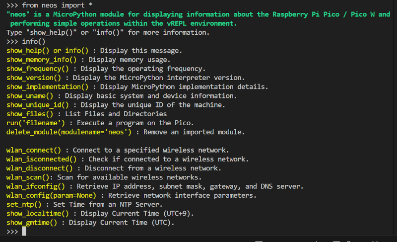

# neos モジュール
vREPL ターミナルから、接続された Raspberry Pi Pico / Pico W の状態を確認できる関数を提供するモジュールです。

[資材置き場topに戻る](../)

 

## 使用例

#### importして関数一覧を表示する

#### 現在のメモリの使用状況を表示する

    >>> show_memory_info()
    memory info:
    total:   191,424 bytes
    use:       8,400 bytes  (4.4%)
    remain:  183,024 bytes
    >>> 

#### MicroPythonのバージョン情報を表示する

    >>> show_version()
    sys.version=3.4.0; MicroPython v1.23.0 on 2024-06-02
    >>> 

 

## ファイル一覧

| ファイル名                   | 内容                  | ver. | 日付       | メモ |
| ---------------------------- | --------------------- | ---- | ---------- | ---- |
| readme.md                    | 本書                  |      | 2025/07/11 |      |
| [neos.md](neos.md)           | neosモジュール説明書  | 1.2  | 2025/07/11 |neosモジュールの変更に伴い説明、説明画面を変更 |
| neos.py                      | neosモジュール本体    | 1.2  | 2025/07/11 |help() を show_help()に変更、同機能の info()を追加、import時の説明表示を追加等 |
| [wlan_info.py](wlan_info.py) | Wi-Fi情報定義ファイル | 1.0  | 2025/03/30 |      |
