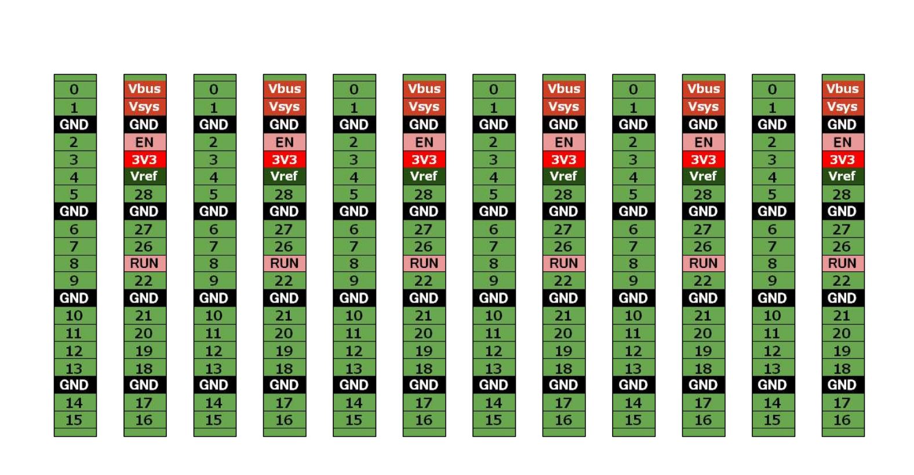

# Raspberry Pi Pico / Pico W 用ピンアサインラベル

## 内容説明と使い方など

- 見た通りですが、ラベル用紙に印刷してカットして貼り付けて使います。
- 超マイナー（失礼？）なアプリで作成しているので、PDFデータを使ってください。

## ファイル一覧

- Pico_pinout_sheet.cld　ピンアサインラベル用データ（らくちんCDラベルメーカー フォーマット）
- Pico_pinout_sheet.pdf　ピンアサインラベルのPDFデータ
  

## ラベルイメージ

## 使用例

