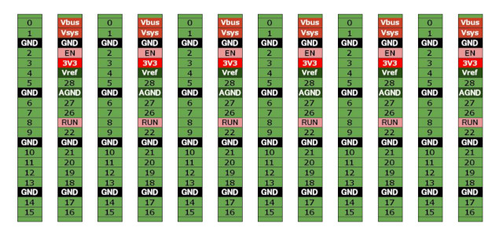
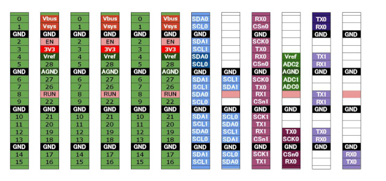

# Raspberry Pi Pico 用ピンアウトラベル

## 内容説明と使い方

- このラベルは、Raspberry Pi Pico / Pico W のピン配置を分かりやすくするためのものです。ラベル用紙に印刷し、カットしてPicoを装着したブレッドボード等に貼り付けたり、ユニバーサル基板の裏の適当な位置に貼り付けて使用します。
- その他信号のラベルは、必要に応じて切り取って使うことを想定しています。
- このラベルは、おそらくあまり知られていない（失礼？）「らくちんCDラベルメーカー」というアプリで作成しました。お持ちでない方は、PDFデータをご利用ください。
- 印刷用紙はハガキサイズを想定していますが、L版の写真用紙にも収まる可能性があります。
- ラベルの各「コマ」の表記は、ピンの位置を示すための略称です。各信号の詳しい意味については、Raspberry Piの公式ピンアウト図をご確認ください。「コマ」の色は、公式ピンアウト図の色とできる限り近づけています。
- 参考資料: [PicoのPinout図(PDF)](https://datasheets.raspberrypi.com/pico/Pico-R3-A4-Pinout.pdf)

## ファイル構成

- pinout_label_type*.cld: ピンアウトラベルデータ（らくちんCDラベルメーカー形式）
- pinout_label_type*.pdf: ピンアウトラベル PDFデータ
  
 

## ラベルイメージ
### typeA（電源とGPIO番号）

### typeB（その他信号）

### typeC（A + B）

 

## 使用例
### ブレッドボードに貼った例

### I2C配線のために該当ラベルを追加した例

### ユニバーサル基板の裏に貼った例
