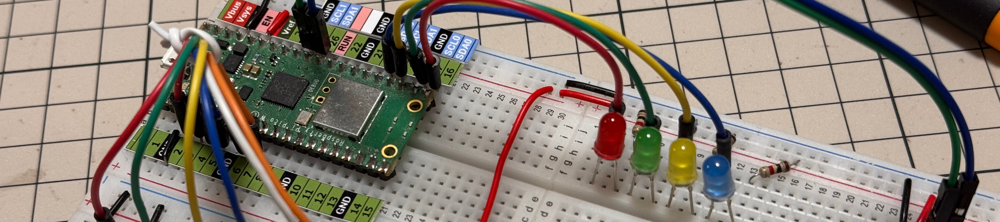

# Raspberry Pi Pico 用ピンアウトラベル

[資材置き場topに戻る](../)

 

## ファイル一覧

| ファイル名                                       | 内容               | ver. | 日付       | メモ |
| ------------------------------------------------ | ------------------ | ---- | ---------- | ---- |
| readme.md                                        | 本書               |      | 2025/04/29 | PDFデータへのリンクを追加した |
| [pico_pinout.md](pico_pinout.md)                 | 説明書             | 1.0  | 2025/04/26 |      |
| pinout_label_typeA.cld                           | typeA ラベルデータ | 1.1  | 2025/06/15 |pin33を GND -> AGNDに変更  |
| [pinout_label_typeA.pdf](pinout_label_typeA.pdf) | typeA PDFデータ    | 1.1  | 2025/06/15 |　　同上    |
| pinout_label_typeB.cld                           | typeB ラベルデータ | 1.0  | 2025/04/18 |      |
| [pinout_label_typeB.pdf](pinout_label_typeB.pdf) | typeB PDFデータ    | 1.0  | 2025/04/18 |      |
| pinout_label_typeC.cld                           | typeC ラベルデータ | 1.1  | 2025/06/15 |pin33を GND -> AGNDに変更  |
| [pinout_label_typeC.pdf](pinout_label_typeC.pdf) | typeC PDFデータ    | 1.1  | 2025/06/15 |　　同上    |
